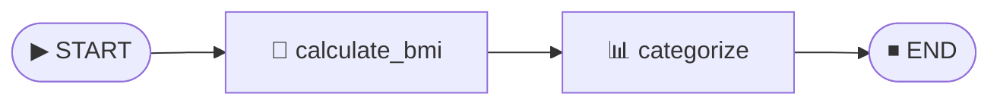
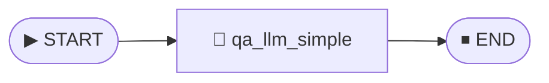
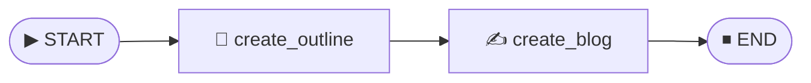
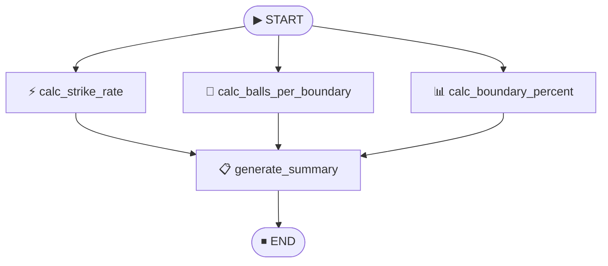
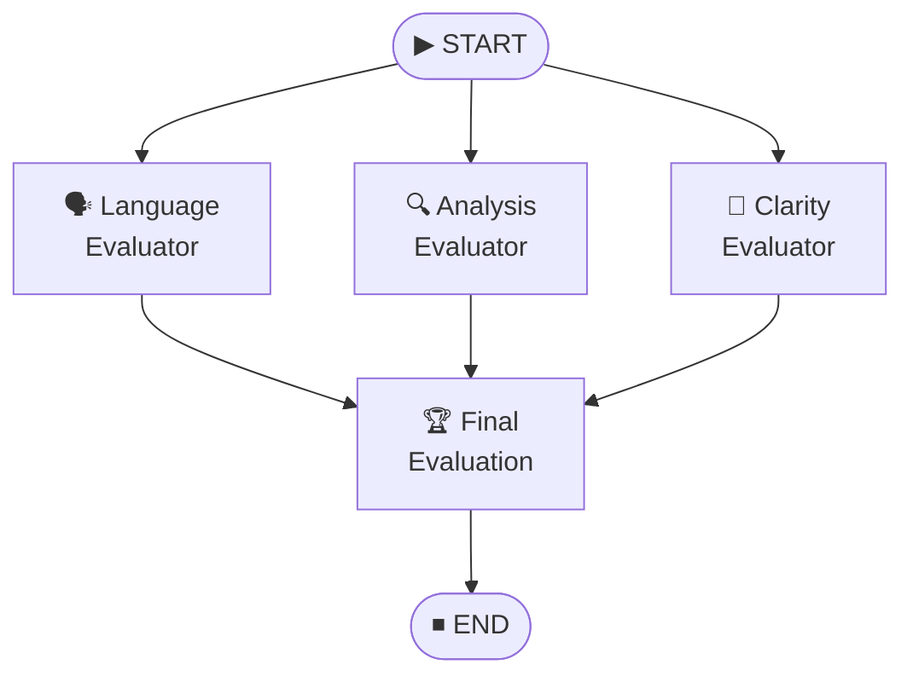
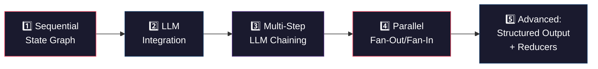

<p align="center">
  
  
  
  
</p>

# 🧠 LangGraph — Agentic AI Workflows

> **A hands-on collection of progressively complex AI agent pipelines built with [LangGraph](https://github.com/langchain-ai/langgraph), demonstrating stateful graph orchestration, parallel fan-out/fan-in execution, structured LLM outputs, and multi-criteria evaluation systems.**

---

## 🏗️ Why This Project?

LangGraph extends LangChain to enable **cyclic, stateful, multi-actor** workflows — the foundation of modern agentic AI. This repository chronicles my learning journey from basic state machines to production-grade AI evaluation pipelines, with each lesson introducing a new LangGraph capability:

| # | Project | Core LangGraph Concept | LLM? |
|---|---------|----------------------|------|
| 1 | [BMI Workflow](#1--bmi-calculator-workflow) | Sequential state graph, TypedDict state | ❌ |
| 2 | [Simple LLM Q&A](#2--simple-llm-qa) | LLM node integration, environment config | ✅ |
| 3 | [Blog Outline Creator](#3--blog-outline-creator) | Multi-step LLM chaining, state propagation | ✅ |
| 4 | [Batsman Run Rate Analyzer](#4--batsman-run-rate-analyzer) | **Parallel fan-out / fan-in** execution | ❌ |
| 5 | [Essay Evaluator](#5--ai-essay-evaluator) | **Parallel LLM evaluation**, Pydantic structured output, state reducers | ✅ |

---

## 📂 Project Structure

```
Langgraph/
├── README.md
└── Lessons/
    ├── 1_bmi_workflow.py            # Sequential state graph
    ├── 2_simple_llm.py              # Single-node LLM integration
    ├── 3_Blog_outline_creator.py    # Multi-step LLM pipeline
    ├── 4_batsman_runrate.py         # Parallel fan-out/fan-in graph
    ├── 5_essay_evaluator.py         # Multi-criteria AI evaluation system
    ├── requirements.txt             # Python dependencies
    ├── .env                         # API keys (not committed)
    └── venv/                        # Virtual environment
```

---

## 🔬 Deep Dive — Each Project Explained

### 1 · BMI Calculator Workflow

> **Concept:** Sequential state graph with typed state management

A pure-logic workflow that demonstrates LangGraph's core primitive — the `StateGraph`. No LLM is involved; this focuses entirely on understanding how state flows through nodes.



**What it does:**
- Accepts `weight_kg` and `height_m` as input state
- Computes BMI using the standard formula: `weight / height²`
- Classifies the result into medical categories (Underweight, Normal, Overweight, Obesity)

**Key Takeaway:** State is a `TypedDict` that flows immutably through the graph — each node reads from and writes back to the shared state object.

<details>
<summary>📸 Sample Output</summary>

```
The BMI is 26.73 and the category is Overweight
```
</details>

---

### 2 · Simple LLM Q&A

> **Concept:** Integrating an LLM as a graph node with environment-based configuration

The first LLM-powered graph — a single-node pipeline that sends a question to OpenAI's GPT-3.5 Turbo and returns the answer through LangGraph's state management.



**What it does:**
- Loads the OpenAI API key securely from a `.env` file via `python-dotenv`
- Wraps `ChatOpenAI` (LangChain) inside a LangGraph node
- Demonstrates state-driven prompt construction: the question is pulled from state, and the answer is written back

**Key Takeaway:** LangGraph nodes can encapsulate any logic — including LLM calls — while the graph handles orchestration and state persistence.

---

### 3 · Blog Outline Creator

> **Concept:** Multi-step LLM chaining with state propagation between nodes

A two-stage content generation pipeline where the output of one LLM call becomes the input of the next — a fundamental pattern in agentic workflows.



**What it does:**
1. **Stage 1 — Outline Generation:** Takes a blog title and generates a structured outline
2. **Stage 2 — Content Writing:** Takes the generated outline and writes a full blog post

**Key Takeaway:** State propagation allows chaining LLM calls where each node enriches the state — the outline node writes `Outline`, and the blog node reads it to produce the final `Blog`. This is the foundation of agentic "chain of thought" execution.

---

### 4 · Batsman Run Rate Analyzer

> **Concept:** Parallel execution with fan-out / fan-in topology

This project introduces **LangGraph's most powerful pattern** — parallel node execution. Three independent computations fan out from START, execute simultaneously, and their results fan back into a single summary node.



**What it does:**
- **Strike Rate:** `(runs / balls) × 100`
- **Balls Per Boundary:** `balls / (fours + sixes)`
- **Boundary Percentage:** `((fours × 4 + sixes × 6) / runs) × 100`
- **Summary:** Aggregates all computed metrics into a human-readable performance card

**Key Takeaway:** When multiple edges originate from `START` (or any node), LangGraph executes those branches **in parallel**. The summary node only executes after all upstream nodes complete — a natural fan-out/fan-in pattern without explicit synchronization.

<details>
<summary>📸 Sample Output</summary>

```
Batsman scored 105 off 60 balls. SR: 175.00, BPB: 4.00, Boundary %: 80.00%
```
</details>

---

### 5 · AI Essay Evaluator

> **Concept:** Parallel LLM evaluation with Pydantic structured output & state reducers

The capstone project — a **multi-criteria AI evaluation system** that demonstrates the most advanced LangGraph patterns in this collection. Three LLM evaluators run in parallel, each producing structured feedback and scores, which are then aggregated into a final evaluation.



**What it does:**
1. **Three parallel LLM evaluators** assess an essay on Language, Analysis, and Clarity
2. Each evaluator returns **structured output** (feedback string + integer score) via a Pydantic schema
3. Individual scores are aggregated using an `Annotated[list[int], operator.add]` **state reducer**
4. A final summarizer LLM synthesizes all feedback into an overall evaluation with an average score

**Advanced Patterns Demonstrated:**

| Pattern | Implementation |
|---------|---------------|
| **Structured Output** | `model.with_structured_output(EvaluateSchema)` — forces GPT-4o to return JSON conforming to a Pydantic model |
| **State Reducers** | `Annotated[list[int], operator.add]` — automatically concatenates scores from parallel branches instead of overwriting |
| **Fan-Out/Fan-In + LLM** | Three GPT-4o calls execute simultaneously, with results merged before the final evaluation |
| **Multi-Model** | Uses GPT-4o (not 3.5 Turbo) for higher-quality evaluation reasoning |

<details>
<summary>📸 Sample Output</summary>

```
--- Essay Evaluation Results ---

Language Feedback: The essay demonstrates strong language proficiency with ...
Analysis Feedback: The essay provides a well-rounded analysis of India's AI ...
Clarity Feedback: The essay maintains a clear and logical flow throughout ...
Overall Feedback: The essay exhibits exceptional quality across all three ...
Individual Scores: [8, 7, 8]
Average Score: 7.7/10
```
</details>

---

## 🚀 Getting Started

### Prerequisites

- Python 3.10+
- An [OpenAI API Key](https://platform.openai.com/api-keys)

### Installation

```bash
# Clone the repository
git clone https://github.com/yourusername/Langgraph.git
cd Langgraph/Lessons

# Create and activate a virtual environment
python -m venv venv
venv\Scripts\activate        # Windows
# source venv/bin/activate   # macOS/Linux

# Install dependencies
pip install -r requirements.txt
```

### Configuration

Create a `.env` file in the `Lessons/` directory:

```env
OPEN_AI_API=sk-your-openai-api-key-here
```

### Run Any Project

```bash
python 1_bmi_workflow.py
python 2_simple_llm.py
python 3_Blog_outline_creator.py
python 4_batsman_runrate.py
python 5_essay_evaluator.py
```

---

## 🛠️ Tech Stack

| Technology | Role |
|-----------|------|
| **[LangGraph](https://github.com/langchain-ai/langgraph)** | Stateful graph orchestration for agentic workflows |
| **[LangChain](https://github.com/langchain-ai/langchain)** | LLM abstraction layer (`ChatOpenAI`) |
| **[OpenAI GPT-3.5 / GPT-4o](https://openai.com/)** | Language model backbone |
| **[Pydantic](https://docs.pydantic.dev/)** | Structured output schema validation |
| **[python-dotenv](https://pypi.org/project/python-dotenv/)** | Secure environment variable management |

---

## 📈 Learning Progression



---

## 📜 License

This project is open-source and available for educational purposes.

---

<p align="center">
  <b>Built with ❤️ while learning Agentic AI</b><br/>
  <sub>If you found this helpful, consider giving it a ⭐</sub>
</p>
