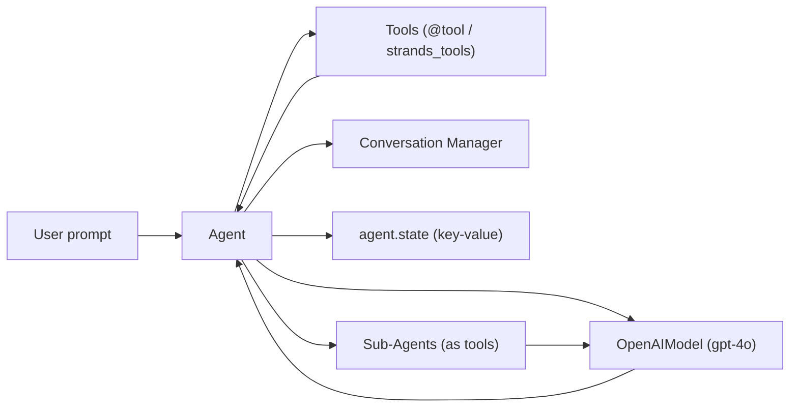

# Strands AI Agents — Learning Series

*A progressive, hands-on tutorial for building AI agents with the Strands Agents SDK and OpenAI.*

---

## What This Is

The Strands Agents SDK documentation covers individual primitives. Blog posts cover toy demos. This repository fills the gap between the two: a structured sequence of 15 lessons that builds from a single agent call to multi-agent swarms and DAG pipelines. Each lesson is a standalone Python file that runs in under a minute and teaches one concept.

If you have used LLM APIs (OpenAI, Anthropic, Bedrock) but have not used Strands, start at Lesson 1. If you already understand single-agent tool use, skip to Lesson 11. If you are only here to see what the repo covers, read the lesson table below and the architecture diagram.

---

## Quickstart

```bash
# 1. Clone
git clone https://github.com/ReubenKuruvilla-Dev/CrewAI_Lessons.git
cd Strands

# 2. Create a virtual environment
python -m venv venv

# Windows
.\venv\Scripts\activate

# macOS / Linux
source venv/bin/activate

# 3. Install dependencies
pip install -r requirements.txt

# 4. Configure API keys — create a .env file in the project root
echo OPENAI_API_KEY=sk-your-key-here > .env

# 5. Run your first lesson
python check_model.py
```

Lesson 6 (`research_agent.py`) requires Tavily. Add it separately:

```bash
pip install tavily-python
echo TAVILY_API_KEY=tvly-your-key-here >> .env
```

---

## Prerequisites

| Requirement | Details |
|---|---|
| Python | 3.10 or higher <!-- TODO: verify minimum — no pyproject.toml or CI config to confirm --> |
| OpenAI API key | Required for all lessons — [platform.openai.com/api-keys](https://platform.openai.com/api-keys) |
| Tavily API key | Required for Lesson 6 only — [app.tavily.com](https://app.tavily.com) |
| Virtual environment | Recommended |

The model used throughout is `gpt-4o` via `strands.models.openai.OpenAIModel`. Every lesson call incurs OpenAI token costs.

---

## Lessons

| # | File | What You Learn | Key Concept |
|---|---|---|---|
| — | [`model_setup.py`](model_setup.py) | Shared model configuration reused by all lessons | `OpenAIModel`, `client_args` vs `params` |
| 1 | [`check_model.py`](check_model.py) | Send a prompt, get a response | `Agent`, `AgentResult` |
| 2 | [`First_agent.py`](First_agent.py) | Self-contained agent without shared imports | Inline model setup |
| 3 | [`stateful_agent.py`](stateful_agent.py) | Multi-turn conversation with persistent history | `agent.messages`, `AgentResult.message` |
| 4 | [`tools_inbuilt.py`](tools_inbuilt.py) | Use built-in tools (`calculator`, `current_time`) | `strands_tools` import pattern |
| 5 | [`custom_tools.py`](custom_tools.py) | Build custom tools with `@tool`, observe tool chaining | `@tool` decorator, type hints, docstrings |
| 6 | [`research_agent.py`](research_agent.py) | Web search + file write via Tavily | Tool chaining, `tavily_search`, `file_write` |
| 7 | [`memory_basics.py`](memory_basics.py) | Verify default conversation memory across turns | `agent.messages`, `callback_handler=None` |
| 8 | [`SlidingWindowConversationManager.py`](SlidingWindowConversationManager.py) | Fixed-window memory: oldest messages are dropped | `SlidingWindowConversationManager`, `window_size` |
| 9 | [`SummarizingConversationManager.py`](SummarizingConversationManager.py) | Summarizing memory: oldest messages are condensed | `SummarizingConversationManager`, `summary_ratio` |
| 10 | [`agent_state.py`](agent_state.py) | Persistent key-value state accessed from tools | `ToolContext`, `agent.state.set()` / `.get()` |
| 11 | [`agentasaTool.py`](agentasaTool.py) | Pass Agent instances as tools to a coordinator | `tools=[agent_a, agent_b]`, `name`, `description` |
| 12 | [`orchestratoragent.py`](orchestratoragent.py) | Orchestrator delegates research and writing to sub-agents | Agent-as-a-tool pattern (research → write) |
| 13 | [`swarm_agent.py`](swarm_agent.py) | Swarm multi-agent with autonomous handoffs | `Swarm`, `entry_point`, `max_handoffs` |
| 14 | [`swarm_coder.py`](swarm_coder.py) | Swarm loop: plan → code → verify → fix | Cyclic handoff between agents |
| 15 | [`graph.py`](graph.py) | DAG pipeline: outline → draft → review | `GraphBuilder`, `add_node`, `add_edge` |

Run any lesson directly:

```bash
python <filename>.py
```

---

## Architecture

All lessons share a common structure: an `Agent` bound to an `OpenAIModel`, optionally equipped with tools, and managed by a conversation manager that controls memory.



In multi-agent lessons (13–15), the top-level entry point changes:

| Pattern | Entry point | How agents connect |
|---|---|---|
| Agent-as-a-tool (11, 12) | `coordinator(prompt)` | Sub-agents listed in `tools=[]` |
| Swarm (13, 14) | `Swarm([agents], entry_point=...)` | Agents hand off to each other by name |
| Graph (15) | `GraphBuilder` → `graph(prompt)` | Explicit edges define execution order |

---

## Design Decisions

- **Shared model module.** `model_setup.py` centralises `OpenAIModel` configuration so every lesson imports the same instance. This avoids duplicating API key handling and makes it easy to swap providers (e.g., to Anthropic or Bedrock) in one place.

- **`callback_handler=None` on sub-agents.** Sub-agents that serve as tools have their streaming callback disabled. Without this, every sub-agent would print its intermediate tokens to stdout, making the coordinator's final output unreadable.

- **No retry or error-handling wrappers.** Each lesson is a minimal, single-concept example. Error handling (rate limits, auth failures, timeouts) is left to the SDK's defaults. This is intentional — the goal is to teach Strands primitives, not production patterns.

- **`@tool(context=True)` for state access.** Tools that need to read or write `agent.state` use the `context=True` flag to receive a `ToolContext` object. This keeps tools decoupled from specific agent instances — the context is injected at runtime.

- **Flat file structure.** All lessons are top-level `.py` files rather than packages or directories. This keeps the barrier to entry low: `python <file>.py` is the only command needed.

---

## Project Structure

```
Strands/
├── model_setup.py                          # Shared OpenAI model config (imported by all lessons)
├── check_model.py                          # Lesson 1  — First agent call
├── First_agent.py                          # Lesson 2  — Standalone agent, inline config
├── stateful_agent.py                       # Lesson 3  — Multi-turn conversation memory
├── tools_inbuilt.py                        # Lesson 4  — Built-in tools + full tool catalog
├── custom_tools.py                         # Lesson 5  — @tool decorator, tool chaining
├── research_agent.py                       # Lesson 6  — Tavily search + file output
├── memory_basics.py                        # Lesson 7  — Default memory verification
├── SlidingWindowConversationManager.py     # Lesson 8  — Sliding window memory
├── SummarizingConversationManager.py       # Lesson 9  — Summarizing memory
├── agent_state.py                          # Lesson 10 — ToolContext and agent.state
├── agentasaTool.py                         # Lesson 11 — Agent as a tool + state logging
├── orchestratoragent.py                    # Lesson 12 — Orchestrator with sub-agent tools
├── swarm_agent.py                          # Lesson 13 — Swarm (customer support triage)
├── swarm_coder.py                          # Lesson 14 — Swarm (plan-code-verify-fix loop)
├── graph.py                                # Lesson 15 — GraphBuilder DAG pipeline
├── requirements.txt                        # Python dependencies
├── .env                                    # API keys (not committed)
└── README.md                               # This file
```

---

## Troubleshooting

| Problem | Cause | Fix |
|---|---|---|
| `openai.AuthenticationError` | Missing or invalid `OPENAI_API_KEY` | Verify the key in `.env`. Run `python -c "import os; from dotenv import load_dotenv; load_dotenv(); print(os.getenv('OPENAI_API_KEY')[:8])"` to confirm it loads. |
| `ModuleNotFoundError: No module named 'strands'` | Dependencies not installed or wrong virtualenv | Activate the venv and run `pip install -r requirements.txt` |
| `ModuleNotFoundError: No module named 'strands_tools'` | `strands-agents-tools` not installed | Run `pip install strands-agents-tools` |
| `ModuleNotFoundError: No module named 'tavily'` | Tavily not installed (only needed for Lesson 6) | Run `pip install tavily-python` and add `TAVILY_API_KEY` to `.env` |
| `openai.RateLimitError` | Too many requests to OpenAI | Wait 30–60 seconds and retry. Consider using a paid OpenAI plan for higher rate limits. |

---

## Dependencies

```
strands-agents            # Core SDK — Agent, tool, ToolContext, multiagent
strands-agents-tools      # Built-in tools (calculator, current_time, file_write, tavily, etc.)
python-dotenv             # Loads .env variables into os.environ
openai>=1.0.0,<2.0.0     # OpenAI Python client (required provider package)
tavily-python             # Tavily web search (Lesson 6 only — not in requirements.txt)
```

> `strands-agents` does not auto-install provider packages. The `openai` package must be installed explicitly.

---

## Author

**Reuben Kuruvilla** — [@ReubenKuruvilla-Dev](https://github.com/ReubenKuruvilla-Dev)

---

## License

<!-- TODO: verify — no LICENSE file exists in the repository -->

This project is intended for educational purposes.
